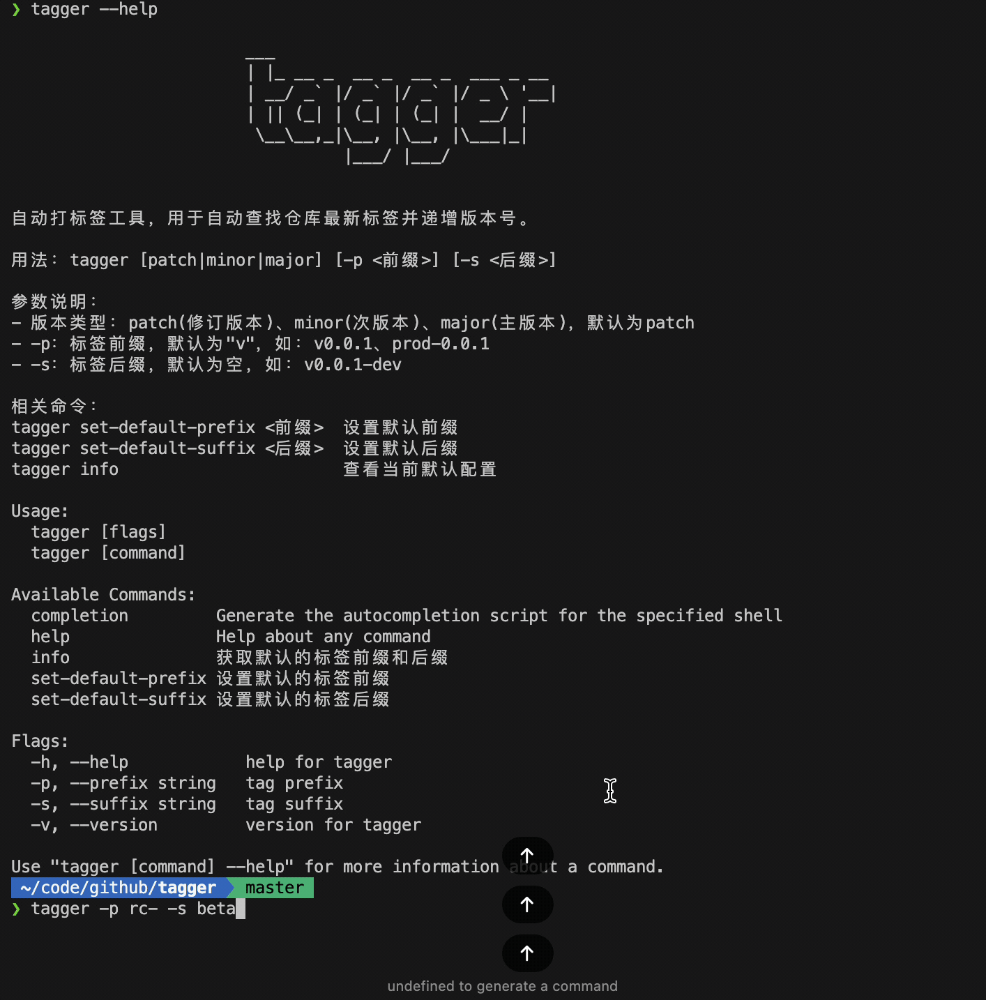

# Tagger

An automated version tag management tool for automatically finding the latest repository tag and incrementing version numbers. Works great with CI/CD pipelines.

> I use it to automatically create tags to trigger pipelines.



## Installation

```bash
curl -s https://get.mereith.com/tagger/tagger.sh | sh
```

If you are a Windows user, please use the `tagger.ps1` script.

```powershell
Invoke-WebRequest -Uri https://get.mereith.com/tagger/tagger.ps1 -OutFile tagger.ps1; .\tagger.ps1
```

> **Note for Mac users: For first-time use, please allow the application to run in "System Settings -> Privacy & Security"**

## Usage

Basic format:

```bash
tagger [version-type] [-p <prefix>] [-s <suffix>]
```

Parameters:

- version-type: patch(default) | minor | major
- -p: tag prefix, defaults to "v", e.g., v0.0.1, prod-0.0.1
- -s: tag suffix, defaults to empty, e.g., v0.0.1-dev

Related commands:

```bash
# Set default prefix
tagger set-default-prefix <prefix>

# Set default suffix
tagger set-default-suffix <suffix>

# View current default configuration
tagger info
```

Examples:

```bash
# Create patch version (v0.0.1 -> v0.0.2)
tagger

# Create minor version (v0.0.1 -> v0.1.0)
tagger minor

# Create major version (v0.0.1 -> v1.0.0)
tagger major

# Use custom prefix (prod-0.0.1 -> prod-0.0.2)
tagger -p prod-

# Use custom suffix (v0.0.1-dev -> v0.0.2-dev)
tagger -s -dev

# Use both prefix and suffix (rc-0.0.1-beta -> rc-0.0.2-beta)
tagger -p rc- -s -beta

# Create minor version with prefix and suffix (test-0.1.0-alpha -> test-0.2.0-alpha)
tagger minor -p test- -s -alpha

# Set default prefix to release-
tagger set-default-prefix release-

# Set default suffix to -stable
tagger set-default-suffix -stable

# Create tag using default prefix and suffix (release-0.0.1-stable -> release-0.0.2-stable)
tagger
```
