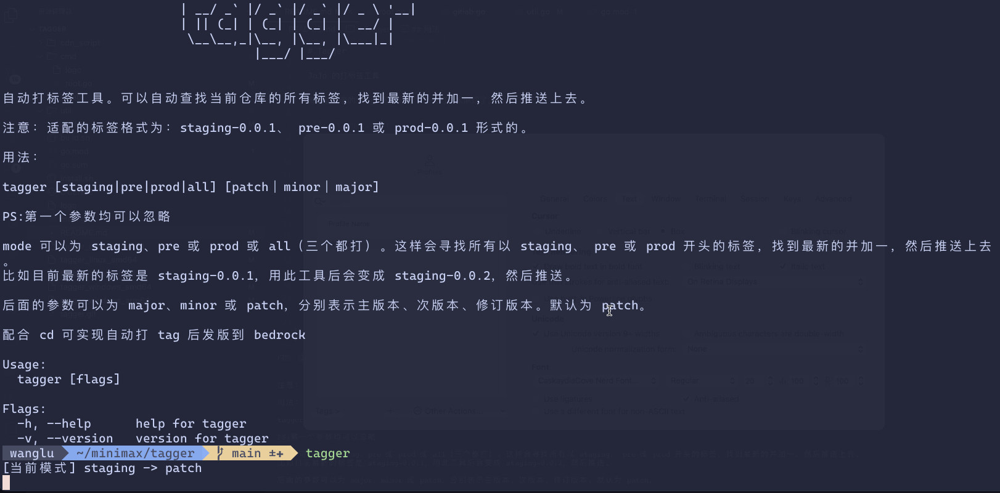

# Tagger

JoJo 的打标签工具

每次都找老的 tag 然后手动 +1 去打，太麻烦了。



## 安装

```bash
# 下载脚本并运行
curl -s https://cdn.mereith.com/tagger/tagger.sh | sh
```

> **对于 Mac 首次运行可能会弹出安全提醒，去系统设置 -> 隐私安全设置允许此应用运行即可。**

## 用法

```bash
# 在项目目录下：
# 第一个参数可以忽略

tagger [staging|pre|prod|all] [patch｜minor｜major] [-p <泳道名字>]

# 例如打一个 staging 的 patch 版本 （最末尾版本号+1）
tagger

# 打一个 staging 的 patch 版本 （最末尾版本号+1），t0001 泳道
tagger -p t0001

# 打 staging 的 minor 版本，t0001 泳道
tagger minor -p t0001

# 打 prod 的 patch 版本
tagger prod

# 打 prod 的 minor 版本
tagger prod minor

# 同时打 staging、 pre 和 prod 的 patch 版本
tagger all

# 同时打 staging、 pre 和 prod 的 minor 版本
tagger all minor


```
